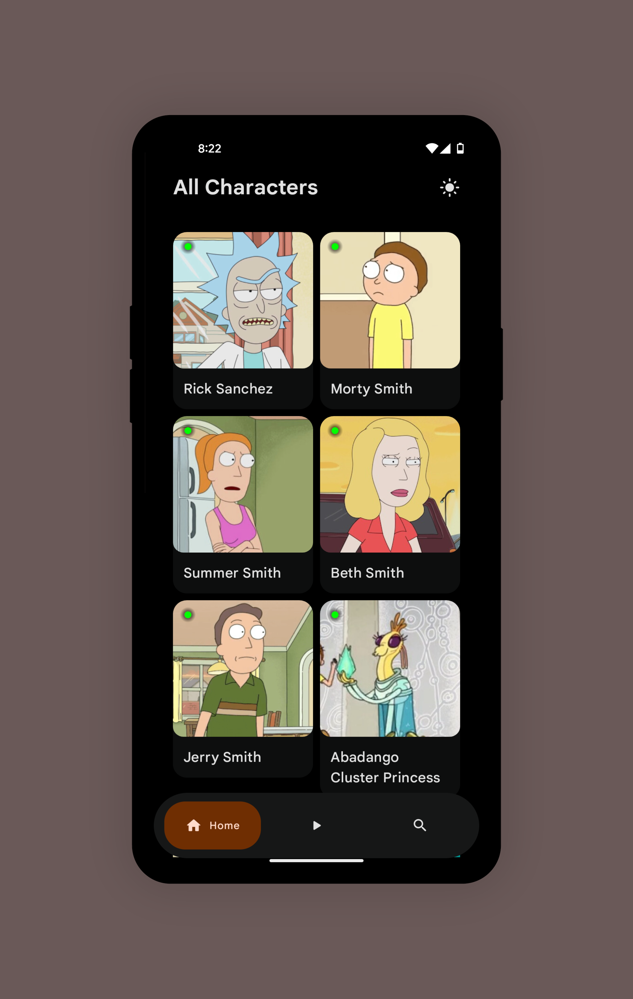
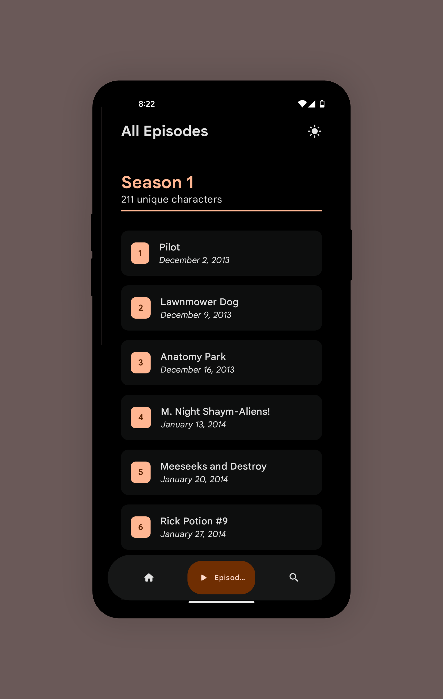
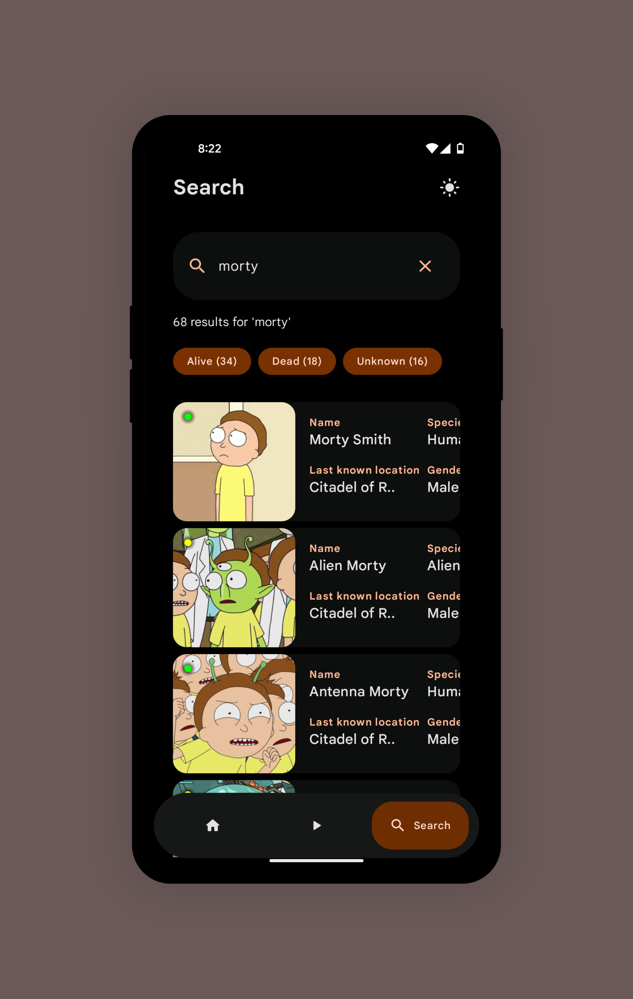
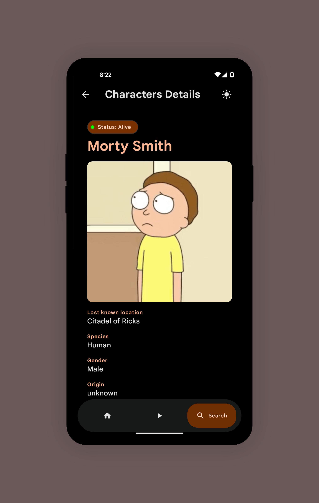

# Rick and Morty Wikipedia App
A fun little project. A modern Android application that provides comprehensive information about the Rick and Morty universe by fetching data from the official Rick and Morty REST API. Built entirely with cutting-edge Android technologies for optimal performance and user experience.

## 📱 What This App Does

This Rick and Morty Wikipedia app serves as your ultimate companion to explore the vast universe of Rick and Morty. Get instant access to detailed information about:

- **Characters** - Explore hundreds of characters with detailed profiles, origins, and current status
- **Episodes** - Browse through all episodes with summaries, air dates, and character appearances  
- **Locations** - Discover various dimensions and planets from the Rick and Morty multiverse

## ✨ Key Features

- **🚀 Fast and Reliable Information Access** - Instant data retrieval from the official API
- **🖼️ Smooth Image Loading** - Seamless image rendering with optimized caching
- **🎨 Visually Appealing Interface** - Modern, intuitive UI built entirely with Jetpack Compose
- **⚡ Optimized Android Performance** - Efficient resource management and smooth animations
- **📱 Responsive Design** - Adaptive layouts that work perfectly on all screen sizes
- **🔍 Search Functionality** - Quick search through characters, episodes, and locations
- **💾 Offline Support** - Cached data for browsing without internet connection

## 🛠️ Tech Stack

- **Language**: Kotlin 100%
- **UI Framework**: Jetpack Compose
- **Networking**: Ktor Client
- **Image Loading**: Coil
- **Architecture**: MVVM with Clean Architecture
- **API**: [Rick and Morty REST API](https://rickandmortyapi.com/)

## 🚀 Getting Started

### Prerequisites

- Android Studio Arctic Fox or later
- Android SDK 21 or higher
- Kotlin 1.8+

### Installation

1. Clone the repository
```bash
git clone https://github.com/yourusername/rick-and-morty-wiki.git
```

2. Open the project in Android Studio

3. Sync the project with Gradle files

4. Build and run the app on your device or emulator

## 📱 Usage

1. **Browse Characters**: Scroll through the extensive character list or use search to find specific characters
2. **Explore Episodes**: View episode details, including which characters appear in each episode
3. **Discover Locations**: Learn about different dimensions and planets in the Rick and Morty universe
4. **Search**: Use the search functionality to quickly find characters, episodes, or locations
5. **Offline Browsing**: Previously viewed content remains accessible without internet connection

## 📸 Screenshots
  
  
  
 

## 🏗️ Architecture

This app follows Clean Architecture principles with MVVM pattern:

- **Presentation Layer**: Jetpack Compose UI with ViewModels
- **Domain Layer**: Use cases and business logic
- **Data Layer**: Repository pattern with Ktor for API calls and local caching

## 🤝 Contributing

Contributions are welcome! Please feel free to submit a Pull Request. For major changes:

1. Fork the repository
2. Create your feature branch (`git checkout -b feature/AmazingFeature`)
3. Commit your changes (`git commit -m 'Add some AmazingFeature'`)
4. Push to the branch (`git push origin feature/AmazingFeature`)
5. Open a Pull Request

## 📄 License

This project is licensed under the MIT License - see the [LICENSE](LICENSE) file for details.

## 🙏 Acknowledgments

- [Rick and Morty API](https://rickandmortyapi.com/) for providing the comprehensive data
- The Rick and Morty community for the inspiration
- Jetpack Compose team for the amazing UI toolkit

---

⭐ If you found this project helpful, please give it a star!

*Wubba Lubba Dub Dub!* 🚀
